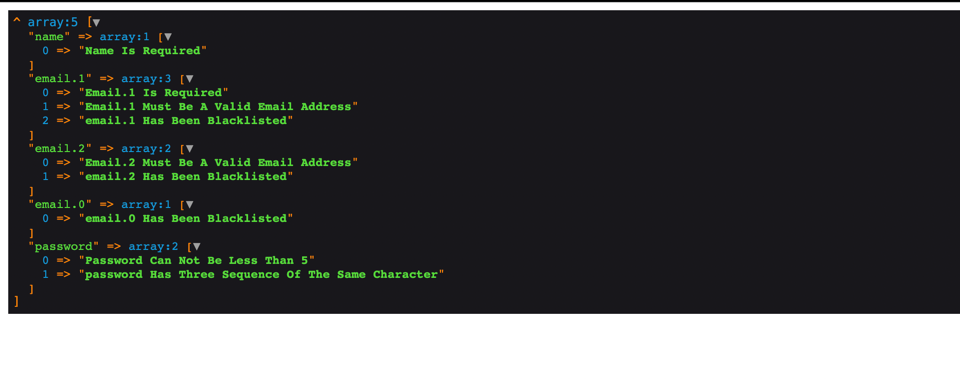

## Tech Stack

* PHP
* Composer

## Download Instruction

1. Clone the project.

```
git clone https://github.com/infinitypaul/quest.git projectname
```


2. Install dependencies via composer.

```
composer install 
```

4. Run php server.

```
php -S localhost:8000
```

5. Sample Response



7. Sample Code 

```php
$check = new \App\Checkers\Check([
    'name' => '',
    'email' => [
        'infinitypaul@live.com',
        '',
        'ade',
        'ade@google.com'
    ],
    'password' => 'eeee'
]);

$check->setRules([
    'name' => [
        'required'
    ],
    'email.*' => [
        new \App\Checkers\Rules\Required(),
        'email',
        'blacklist'
    ],
    'password' => [
        'min:5',
        'sequence'
    ]
]);


if(!$check->validate()){
    dump($check->getErrors());
} else {
    dump("passed");
};
```
You can either define your rules as a class
```php
new \App\Checkers\Rules\Required(),
```

or as a string

```phpregexp
required
```

you can also define your own rule by extending the Rule Class

```php
class EmailRule extends Rule
{

    /**
     * @param $field
     * @param $value
     * @return bool
     */
    public function passes($field, $value): bool
    {
        return filter_var($value, FILTER_VALIDATE_EMAIL);
    }

    /**
     * @param $field
     * @return string
     */
    public function message($field): string
    {
        return ucwords($field. ' Must Be A Valid Email Address');
    }
}
```

If you prefer it to br string base, you can define it in the RuleMap.php

```php
'email' => EmailRule::class
```


###Organization Password Policy

The service is very flexible, and new rules can be added without much code.

What is needed is to create a new rule, extend the RULE class, and define all your conditions and organization password policy like the one below 

* Password/Passphrase Length Policy
* Password Deny List
* Password Combination
* Password Checks to be sure it isn't part of the leaked password


